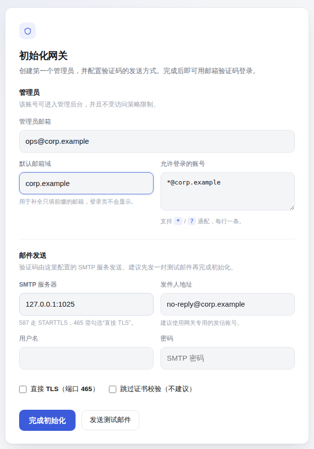
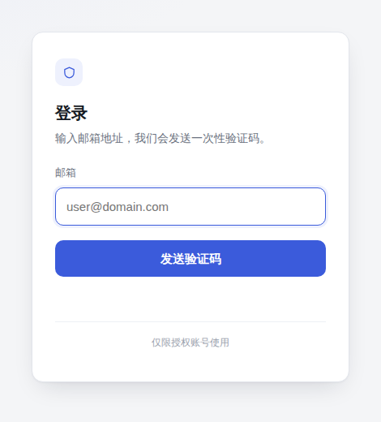
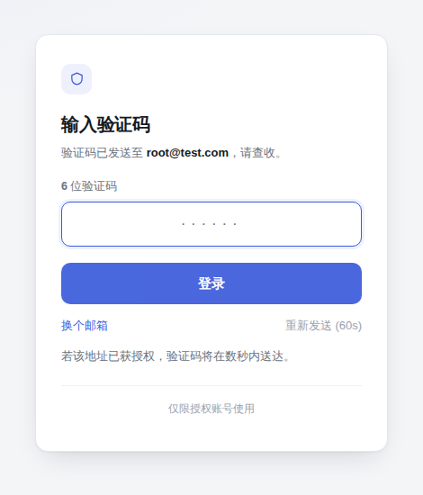
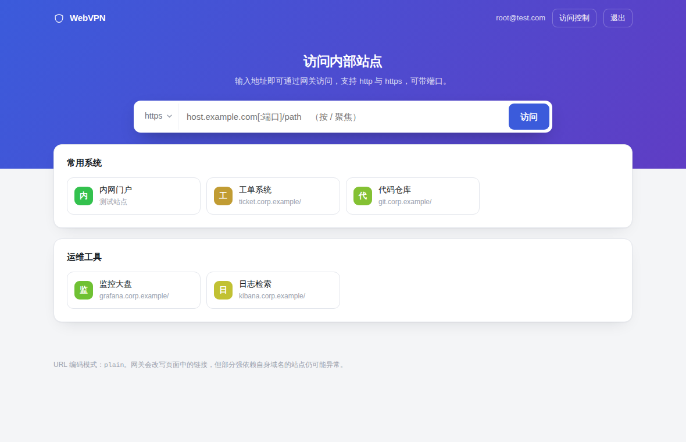
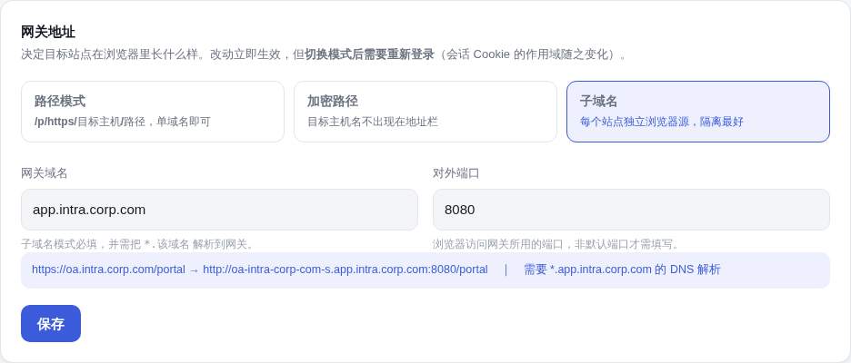
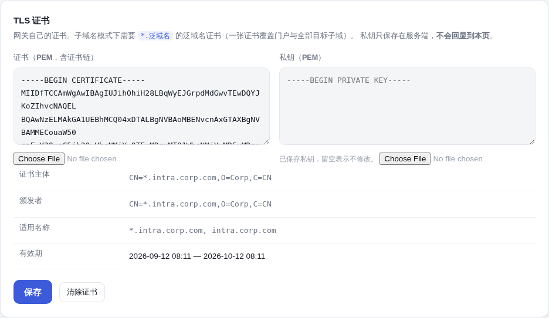
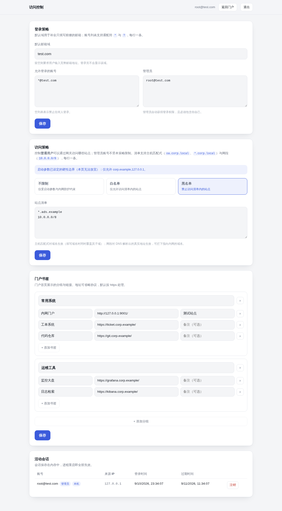
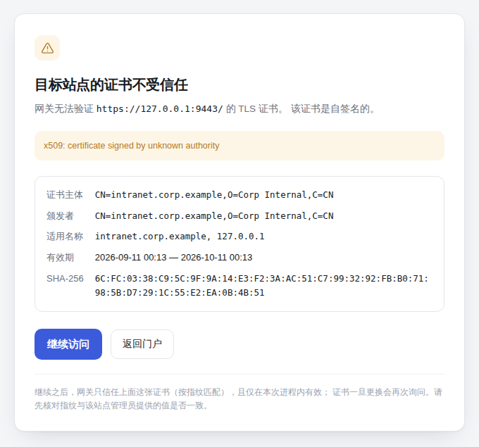

# WebVPN

一个用 Go 实现的 WebVPN 网关：浏览器用邮箱验证码登录后，在门户里输入任意 http/https 地址，
由网关代为访问并改写响应，使整个站点后续的请求都回流到网关。本质上是一个**按目标动态路由的
反向代理 + 内容改写器**，不需要客户端安装任何东西。

```
浏览器 ──TLS──> WebVPN 网关 ──> 目标站点 (http/https/ws/wss)
          登录态          URL 编解码 + HTML/CSS 改写 + 运行期 JS 补丁
```

## 功能

- **反向代理**：任意 http/https 目标，支持查询串、跳转、Cookie、gzip、SSE 与 WebSocket 升级。
- **三种 URL 编码模式**（可插拔 `Codec`）：
  | 模式 | 形态 | 说明 |
  | --- | --- | --- |
  | `plain`（默认） | `/p/https/example.com/path?q=1` | 可读、易调试，单域名即可部署 |
  | `wrd` | `/https/<hex(iv)+hex(enc(host))>/path` | 目标主机名不出现在地址栏；形态对齐国内高校常见商用产品 |
  | `subdomain` | `http://a--b-example-com-s.<泛域名>/path` | 每个目标独立浏览器 Origin，隔离最好；需要泛域名 DNS 与泛域名证书。端口编码为 `-p8080` 后缀 |
- **单点登录可用**：域级 Cookie（`Domain=.corp.example`）由网关按浏览器会话存放并按域回放，
  跨主机的 SSO 跳转链路可以走通；Cookie 一律按原始字节透传，不经 Go 的 cookie 序列化器。
- **内容改写**：HTML（`href/src/srcset/action/formaction/poster/data/xlink:href/style/<base>/meta refresh` 等）、
  CSS（`url()` / `@import`）、`Location` 与 `Link` 响应头、`Set-Cookie` 作用域。
- **跳转不会逃出隧道**：连 `location.href = "https://其他主机/"` 这种无法被补丁拦截的赋值式跳转，
  也会被 Navigation API 取消并改走网关；不支持该 API 的浏览器由脚本内绝对地址改写兜底。
- **运行期补丁**（注入的 `shim.js`）：`fetch`、`XMLHttpRequest`、`WebSocket`、`EventSource`、
  `sendBeacon`、`window.open`、`setAttribute`、元素 `src/href` 属性写入、`history.pushState/replaceState`，
  以及针对 `innerHTML` 生成节点的 `MutationObserver` 兜底。
- **开箱即用的首次初始化**：没有配置文件时，启动日志里打印一次性初始化链接，在浏览器中创建
  第一个管理员并配置发信服务，无需手改 JSON。
- **邮箱验证码登录**：可配置默认域（只填前缀自动补全），会话保存在内存中，滑动续期。
- **自签名证书由用户确认**：目标站点证书验证失败时展示证书详情（主体、颁发者、有效期、SHA-256
  指纹）并询问是否继续；确认后按**指纹**固定信任该证书，换证书会再次询问。
- **管理后台**（`/admin`，改动立即生效，无需重启）：
  - 网关地址：URL 模式（路径 / 加密路径 / 子域名）、泛域名、门户主机与对外端口，带实时预览；
  - TLS 证书：粘贴或选择 PEM 证书与私钥，展示主体 / 颁发者 / 适用名称 / 有效期；
  - 登录策略：默认邮箱域、允许登录账号（`*` / `?` 通配）、管理员列表；
  - 邮件发送：SMTP 服务器、发件人、认证与 TLS 选项，可一键发送测试邮件；
  - 访问策略：不限制 / 白名单 / 黑名单三选一，配合站点清单使用（仅约束普通用户，管理员豁免）；
  - 单点登录：请求参数里的回跳地址还原为真实地址，可对全部站点生效或只对 SSO 域生效；
  - 门户书签：分组与链接的可视化增删改（门户中输入地址或点击书签，均在新标签页打开）；
  - 活动会话：查看与强制注销。
- **SSRF 防护**：默认拒绝环回、RFC1918、链路本地、CGNAT、组播地址，且在 `net.Dialer.Control`
  中对**实际解析结果**再校验一次，因此 DNS 重绑定（DNS rebinding）同样被拦下。

## 界面

首次启动的初始化页面：创建第一个管理员并配置发信服务。



登录页只有一个邮箱输入框：既不出现产品名称，也不出现默认邮箱域，
对未认证访问者不暴露任何组织信息。

<p align="center">
  
  
</p>

登录后的门户：协议选择 + 地址栏直达，下面是最近访问（仅存于本地浏览器）与运维配置的常用链接。
地址栏直达与书签都在**新标签页**中打开，门户本身留在原处，方便接着开下一个站点；最近访问随即刷新，无需重新加载。



网关地址在后台切换，带实时预览与 DNS 提示：



泛域名证书也在后台配置，保存后展示解析出的证书信息：



管理后台：网关地址、登录策略、邮件发送（SMTP）、访问策略（黑白名单 + 站点清单）、门户书签编辑、活动会话。



目标站点证书验证失败时的询问页面：

<p align="center"></p>

## 快速开始

```bash
go build -o webvpn ./cmd/webvpn
./webvpn -addr 127.0.0.1:8080 -allow-private
```

首次启动没有配置文件时，日志里会打印一次性初始化链接：

```
──────────────────────────────────────────────────────────────────
  首次启动：尚未配置管理员
  请在浏览器中打开以下链接完成初始化：

    http://127.0.0.1:8080/setup?token=XA67MT-32EXY6-S5HA24-6D62FS

  该令牌仅在本次进程内有效，管理员首次登录成功后即失效。
──────────────────────────────────────────────────────────────────
```

打开它，填写管理员邮箱与 SMTP（可先"发送测试邮件"验证），完成后即可用验证码登录。

本地开发若不想配 SMTP，加 `-ignore-email`，验证码会打印到控制台；
非交互部署则用参数一次性带齐，跳过初始化页面：

```bash
./webvpn -addr 127.0.0.1:8080 -allow-private -ignore-email \
       -default-domain test.com -allow-user '*@test.com' -admin 'root@test.com'
```

生产环境用 SMTP 发信：

```bash
WEBVPN_SMTP_PASS='...' ./webvpn -addr :443 \
  -tls-cert /etc/ssl/webvpn.crt -tls-key /etc/ssl/webvpn.key \
  -smtp-addr smtp.example.com:587 -smtp-user no-reply@example.com -smtp-from no-reply@example.com \
  -default-domain example.com -allow-user '*@example.com' -admin 'ops@example.com' \
  -config /var/lib/webvpn/config.json -bookmarks /etc/webvpn/bookmarks.json
```

## 命令行参数

| 参数 | 默认值 | 说明 |
| --- | --- | --- |
| `-addr` | `:8080` | 监听地址 |
| `-tls-cert` / `-tls-key` | — | 证书文件；提供时**优先于后台配置的证书** |
| `-url-mode` | — | 首次启动时写入的 URL 模式：`plain` / `wrd` / `subdomain`；之后由管理后台接管 |
| `-url-key` | 见下文 | `wrd` 模式的 AES 密钥（16/24/32 字节），仅命令行可配 |
| `-base-domain` | — | 首次启动时写入的泛域名（目标子域挂在它下面），如 `intra.corp.com` |
| `-portal-host` | — | 首次启动时写入的门户主机名，留空即 `app.<泛域名>` |
| `-public-port` | — | 首次启动时写入的对外端口 |
| `-allow` / `-deny` | — | 目标主机白/黑名单，逗号分隔，按域名后缀匹配。这是**硬性边界**，管理后台无法放宽 |
| `-allow-private` | `false` | 允许访问环回/RFC1918/CGNAT 地址（内网网关通常需要开启，见安全须知）。链路本地与组播地址始终拒绝 |
| `-insecure-tls` | `false` | 不校验上游证书 |
| `-js-rewrite` | `related` | 脚本与 JSON 中绝对地址的改写范围：`off` / `related`（同注册域）/ `all` |
| `-max-rewrite-bytes` | `8MiB` | 超过此大小的响应体不改写，直接透传 |
| `-no-auth` | `false` | 关闭登录（仅供开发） |
| `-config` | `webvpn-config.json` | 管理后台可写的策略文件 |
| `-default-domain` / `-allow-user` / `-admin` | — | 策略文件不存在时的初始值 |
| `-session-ttl` / `-code-ttl` | `12h` / `5m` | 会话与验证码有效期 |
| `-ignore-email` | `false` | **把验证码打印到控制台**，不发邮件 |
| `-smtp-addr` / `-smtp-user` / `-smtp-pass` / `-smtp-from` | — | SMTP 提交服务，作为管理后台未配置时的兜底；密码优先取环境变量 `WEBVPN_SMTP_PASS` |
| `-smtp-tls-mode` | `auto` | `auto`（支持 STARTTLS 就升级）/ `require` / `none` / `implicit`（465 直接 TLS） |
| `-smtp-allow-plaintext-auth` | `false` | 允许在未加密连接上发送 SMTP 账号密码 |
| `-smtp-helo` | — | EHLO 名称，部分中继拒绝默认值 |
| `-smtp-implicit-tls` | `false` | 直接 TLS（465）而非 STARTTLS（587） |
| `-name` | `WebVPN` | 门户标题 |
| `-bookmarks` | — | 书签 JSON 文件，仅在首次启动（策略文件中还没有书签时）导入一次，之后由管理后台接管 |
| `-trust-proxy-headers` | `false` | 无条件相信 `X-Real-IP` / `X-Forwarded-For`；来自**环回地址**的连接无论该参数如何都会读这两个头（本机 nginx 反代即属此列） |

`bookmarks.json` 的格式（仅用于首次导入，之后在管理后台里编辑）：

```json
[
  {"name": "常用系统", "items": [
    {"name": "内网门户", "url": "http://portal.corp.local/", "note": "说明文字，可省略"}
  ]}
]
```

## 网关地址与子域名模式

URL 模式、泛域名、门户主机、对外端口都在管理后台"网关地址"里配置，**改完立即生效、无需重启**
（启动参数只在首次运行时写入一次，之后由后台接管）。

子域名模式下有两个名字：

| | 填什么 | 作用 |
| --- | --- | --- |
| 泛域名 | `intra.corp.com` | 目标站点的子域都挂在它下面，需把 `*.intra.corp.com` 解析到网关 |
| 门户主机 | 留空即 `app.intra.corp.com` | 网关自己的页面：门户、登录、管理后台 |

门户主机本身就落在泛域名之内，网关会把它排除在目标空间之外：`app.intra.corp.com` 不会被当成
某个目标的编码，而一个恰好会编码到该名字的目标会退回 `/p/...` 路径形式，不会把控制台顶掉。

地址形态：

```
https://oa.intra.corp.com/portal       → https://oa-intra-corp-com-s.intra.corp.com/portal
http://oa.intra.corp.com:8080/portal   → http://oa-intra-corp-com-p8080.intra.corp.com/portal
门户与登录                              → https://app.intra.corp.com/
```

规则：`.` → `-`，`-` → `--`，非默认端口追加 `-p<端口>`，https 追加 `-s`。
DNS 标签上限 63 字符，超长的主机名（以及 IPv6 字面量）自动回退到 `/p/...` 路径形式，
该形式在网关的每个主机上都可用。

### TLS 证书

子域名模式需要 `*.泛域名` 的泛域名证书——一张证书同时覆盖门户与全部目标子域。
证书和私钥可以直接在后台"TLS 证书"里粘贴或选择文件，保存后会显示解析出的主体、颁发者、
适用名称与有效期。

- **私钥不回显**：配置接口只返回"是否已配置"，保存时留空表示沿用已存私钥，另有显式的"清除证书"。
- **换证书即时生效**：证书在每次 TLS 握手时从配置中读取，续期后无需重启。
- **首次配置证书需要重启一次**：进程启动时才能决定这个端口说不说 TLS，明文监听器无法中途改口。
  后台会在这种情况下给出提示。
- `-tls-cert` / `-tls-key` 指向文件时优先于后台配置（适合用 ACME 客户端自动续期的部署）。

### 换到这个模式之后

- **每个站点有自己的浏览器 Origin**，这是它最大的价值：一个被代理站点的 XSS 不再能读到其它站点的页面。
  代价是站点之间的 XHR 变成了真正的跨域请求，与直连时的规则一致（由目标自己的 CORS 头决定）。
- **会话 Cookie 的作用域是泛域名**（`Domain=intra.corp.com`），一次登录覆盖门户与所有目标子域；
  因此切换模式后需要重新登录一次。
- **`/login`、`/admin` 等只属于门户主机**；在被代理的子域上，这些路径归目标站点所有，不会被网关页面遮蔽。

这也是"赋值式跳转"的最优解：注入脚本知道泛域名，运行期生成的地址同样走子域形式，
而真实域名与网关子域一一对应，跳到哪儿都还在网关上。

## 首次初始化

没有管理员的网关谁都登录不进去，而"第一个访问者自动成为管理员"对一台网关来说太危险——
端口一暴露就归先到的人。所以初始化由**启动日志中打印的一次性令牌**把关：能读到网关控制台，
就是运维本人，这也是此刻唯一存在的凭据。

流程：

1. 启动时若配置里没有管理员，日志打印 `/setup?token=…`（令牌 120 位随机，仅存于内存）；
2. 打开该链接，填写管理员邮箱、默认域、允许登录的账号与 SMTP；可先"发送测试邮件"验证发信；
3. 完成后跳转登录页，用该邮箱收验证码登录。

几点设计取舍：

- **令牌只给"配置"权限，不给"访问"权限**：初始化之后仍需通过邮箱验证码证明你控制那个邮箱。
- **令牌在管理员首次登录成功后才失效**，而不是提交表单即失效——否则 SMTP 填错一个字母就没人能进来了。
- 用启动参数（`-admin` / `-allow-user`）预置管理员时，不进入初始化模式，适合自动化部署。

## 自签名证书

内网站点用自签名或私有 CA 签发的证书是常态，直接拒绝会让网关没法用；而 `-insecure-tls`
是另一个极端——对所有目标静默接受任何证书。

网关的做法与浏览器一致：停下来，把证书摊开给你看（主体、颁发者、适用名称、有效期、SHA-256 指纹），
由你决定是否继续。确认之后，网关**只信任这一张证书**（按指纹匹配），而不是关闭该主机的校验——
证书一旦更换会再次询问。

- 信任只存在内存中，进程重启即失效。
- 确认接口只接受网关刚刚展示过的证书指纹（10 分钟内），避免被构造请求预置信任。
- 子资源请求（图片、脚本）不会渲染询问页，只返回明确的错误；询问只出现在页面跳转上。
- 需要对所有目标一律跳过校验时仍可用 `-insecure-tls`，但那会丢掉上面全部保护。

**注意**：确认是网关级的，任一登录用户确认后对所有用户生效（日志会记录是谁确认的）。
这在内网网关的使用场景下是合理的折中，但如果你的用户群不可信，请用 `-allow` 收窄可达范围。

## 邮件发送

验证码的投递方式按以下优先级决定：

1. `-ignore-email`：验证码打印到进程日志，**覆盖一切**，仅用于本地开发；
2. 管理后台"邮件发送"里配置的 SMTP（一旦填了服务器与发件人就生效，改完立刻生效，无需重启）；
3. 启动参数 `-smtp-addr` 等，作为后台尚未配置时的兜底。

三者皆无时进程会拒绝启动并给出提示——否则没人能收到验证码，等于服务不可用。

首次部署的引导顺序：用 `-ignore-email` 起一次，从控制台读验证码登录，在后台把 SMTP 填好，
然后去掉该参数重启。后台页面上有"保存并发送测试邮件"，走的是与真实验证码完全相同的发送路径。

支持的传输组合：

| 场景 | 配置 |
| --- | --- |
| 内网中继，25 端口，无认证 | 地址填 `relay:25`，用户名密码留空，模式 `auto` |
| 提交服务，587 + STARTTLS | 模式 `auto` 或 `require` |
| 提交服务，465 直接 TLS | 模式 `implicit` |
| 25 端口且必须认证 | 勾选“允许明文认证”，凭据将以明文经过网络 |

认证机制按服务器通告自动选择：未加密时优先 CRAM-MD5（口令不过网），否则 PLAIN / LOGIN
（`AUTH LOGIN` 是 Exchange 等旧中继的唯一选项，Go 标准库不实现，网关自己实现了）。

> 为什么不是直接用 `net/smtp.SendMail`：它在未加密连接上拒绝认证，只抛出 `unencrypted connection`，
> 既不说明原因也没有开关。默认拒绝是对的，无条件拒绝不是——25 端口的内网中继是常态。

几点与安全相关的设计：

- **密码不回显**：`GET /admin/api/config` 只返回 `password_set: true|false`，不返回密码本身；
  保存时留空表示"沿用已保存的密码"，另有显式的"清除已保存的密码"。
- **测试邮件只发给当前登录的管理员**，接口不接受收件人参数——否则这个表单就是一台开放的发信中继。
- **密码以明文存在配置文件里**（0600）。单机部署没有可用来加密它的密钥托管，与其做"看起来加密"
  的混淆不如说清楚：请给网关配一个专用发信账号或应用专用密码，不要用重要邮箱的主密码。

## Cookie 与单点登录

两个只有代理才会遇到的问题，都会表现为“登录成功后立刻提示登录态失效”：

**一、Cookie 的字节必须原样透传。** Go 的 `net/http` 对 cookie 很严格：值里含非 ASCII 字符的
`Set-Cookie` 会被**整条丢弃**，含空格或逗号的值会被重新加引号，而 `Request.AddCookie` 会把
非法字节从值里剔除。任何一条都足以毁掉一个会话令牌——且只影响那些令牌恰好含这类字节的系统，
所以“并非所有系统都有这个问题”。网关因此把 Cookie 当文本处理：只改属性，`name=value` 原样搬运。

**二、域级 Cookie 无处安放。** SSO 的做法是给整个域签发一张 Cookie（`Domain=.corp.example`），
域内所有站点都能读到。但网关把这些站点放在**同一个浏览器源**下，彼此只靠路径隔离，而路径是按主机分的，
没有第二个域可以承载它。所以带 `Domain` 的 Cookie 由网关**按浏览器会话存在服务端**，
在请求匹配该域的目标时回放。这正是让“在 sso.corp.example 登录、跳回 app.corp.example 后仍是登录态”成立的机制。

细节：

- 服务端 Cookie 罐按登录会话隔离（键取会话令牌的哈希，不另存令牌本身），空闲 12 小时回收。
- `Domain` 等于自身主机的 Cookie 会**同时**放进罐子和浏览器，页面脚本仍可读到自己的 Cookie。
- `Domain` 与目标主机无关的 Cookie 被丢弃——真实浏览器同样会拒绝。
- 关闭登录（`-no-auth`）时没有会话可挂，域级 Cookie 退回浏览器路径隔离的老行为。

### 回跳地址还原（redirect_uri / service / RelayState）

SSO 还有一处**响应改写修不好**的地方：应用跳转到身份提供方时，会带上一个说明“登录后回到哪里”的参数——
OIDC 的 `redirect_uri`、CAS 的 `service`、SAML 的 `RelayState`。这个值由应用从**浏览器当前地址**推导而来
（`window.location.origin`，或网关自己改写过的链接），经过网关后它就是网关地址：

```
应用侧真实行为   https://sso.corp.com/authorize?redirect_uri=https://soc.corp.com/callback   ✓
经过网关         https://sso.corp.com/authorize?redirect_uri=https://app.intra.corp.com/...  ✗ 校验不通过
```

身份提供方会拿它与为该应用**注册**的回调地址比对，对不上就直接拒绝登录。

方向与响应改写相反：请求**发往目标站点之前**，把参数里的网关地址还原成它所代表的真实地址。
提供方于是看到自己登记的那个回调，它答复的跳转再按常规改写回网关形式。三种形态都能还原：

| 参数里的地址 | 还原为 |
| --- | --- |
| `https://soc-corp-com-s.intra.corp.com/cb`（子域形式） | `https://soc.corp.com/cb` |
| `https://app.intra.corp.com/p/https/soc.corp.com/cb`（路径形式） | `https://soc.corp.com/cb` |
| `https://app.intra.corp.com/cb`（裸网关地址，即 `location.origin`） | 判定当前页面所属站点，见下 |

作用范围：查询串，以及 `application/x-www-form-urlencoded` 请求体（SAML/CAS 常用 POST 绑定，上限 1 MB）。
只改动值中**属于网关**的绝对地址，参数名、顺序与其余取值原样保留；不是网关的地址不动——登录表单里
`execution`、`authentication-session-id`、用户名口令这类参数不含地址，一个字节都不会被碰。

**裸网关地址怎么判定来源。** 子域形式与路径形式都自带目标，精确解码即可；只有 `location.origin`
这种裸地址什么都不带——路径模式下所有被代理的页面共用一个源，地址本身说明不了它代表哪个站点。
依次用两条线索：

1. **`Referer`**：最准，指明发起请求的正是哪个页面（含 iframe 内的页面）。
2. **该浏览器的访问轨迹**：不少企业系统会关掉 Referer（`Referrer-Policy: no-referrer`），此时按
   网关为每个浏览器记的**前后两个文档**判定——子资源归属当前文档，跳转到新文档则归属它的上一个文档。
   轨迹按登录会话隔离（未开登录时按来源 IP + User-Agent），空闲 2 小时回收，只在内存中。

两条都没有（浏览器开局第一条请求就直奔 SSO）时退回目标站点自身——此时来源本就无从得知。

后台“单点登录”一节控制它：默认**全部站点**生效（参数里出现网关地址本就不是源站期望的形态），
也可以改为**按域名**只对 `sso.corp.com` 这类身份提供方生效，或整体关闭。

### 赋值式跳转

`location.href = "https://sso.intra.com/"` 是拦不住的：该属性是 unforgeable 的，任何补丁都看不到这次赋值。
但**导航本身**能看到——Navigation API 的 `navigate` 事件对跨源导航同样触发，实测 `cancelable: true`
（`canIntercept` 为 false 不影响取消）。所以注入脚本会取消这次导航，改用网关地址重新发起：

```
location.href = "http://sso.intra.com/login"
   → navigate 事件（cancelable）→ preventDefault()
   → navigation.navigate("/p/http/sso.intra.com/login")
```

覆盖范围：Chromium 102+（Chrome / Edge）。Firefox 与 Safari 尚未提供该 API，因此还有一层兜底——
**在脚本执行之前就把地址改掉**：网关会改写脚本与 JSON 响应（含 HTML 内联脚本）中的绝对地址，
默认只改与当前站点**同注册域**的主机（`-js-rewrite related`），这正是 SSO 跳转发生的范围；
`all` 改写全部可代理地址，`off` 完全不动脚本。

之所以默认只改同域：脚本里的绝对地址未必是导航目标，也可能是用来比较的字符串，改写范围越大误伤越多。
只替换 `scheme://host` 部分，其后路径原样保留。

两条路径实测（A/B 对照，浏览器真实执行）：

| | 赋值式跳转后所在位置 |
| --- | --- |
| v0.3.0（无本次修复） | `http://app.corp.example:9101/` —— **已离开网关** |
| 本版本（`-js-rewrite off`，仅靠 Navigation API） | `http://gw/p/http/app.corp.example:9101/` —— 仍在隧道内 |
| 本版本（`-js-rewrite related`） | 脚本里的地址在执行前已改为 `/p/http/sso.corp.example:9102/login?back=` |

仍然无解的情形：非 Chromium 浏览器 + 地址在运行时拼接（脚本里没有可改写的字面量）。
这种站点请用[子域名模式](#网关地址与子域名模式)——注入脚本知道网关域名，运行期拼出的地址也会走子域形式。

## 访问策略

管理后台的“访问策略”决定**普通用户**能通过网关访问哪些站点。它与启动参数是**两层**关系：
`-allow` / `-deny` 是运维设定的硬性边界，后台策略只能在这个边界内进一步收紧。

**管理员账号不受访问策略约束**——管理员可以随时改写这份清单，让它拦住自己没有意义。
但启动参数的硬边界与内网地址防护对管理员同样生效：那是网关所在主机的边界，不是后台的设置项。
换句话说，一个管理员账号等同于一张进入 `-allow` 范围内全网的通行证，请按特权账号管理。

| 模式 | 行为 |
| --- | --- |
| 不限制 | 只受启动参数与内网防护约束 |
| 白名单 | 仅允许访问站点清单命中的目标（清单不能为空） |
| 黑名单 | 站点清单命中的目标一律拒绝 |

站点清单每行一条，两种写法：

- **主机匹配式**：`oa.corp.local`（不含通配符时同时覆盖其子域，如 `x.oa.corp.local`）、
  `*.corp.local`、`git-*.corp.local`。在 DNS 解析之前按目标主机名匹配。
- **网段**：`10.0.0.0/8`、`fd00::/8`。在**解析出真实地址之后**匹配，因此可以拦下
  “域名看着人畜无害、实际指向内网”的情况，也可以用一条规则放行整个内网。

两个阶段都会判定：主机名阶段命中即可给出结论；白名单模式下主机名没命中但清单里有网段时，
判定推迟到连接前的地址阶段（因此错误可能表现为 502 而不是 403）。

需要留意的固有限制：仅按名字拦截时，用户可以用 IP 直连或换一个指向同一站点的域名绕开黑名单。
要真正封住一个网段，请写 CIDR 规则。

## 登录与权限

- 登录页标题只有“登录”，**不出现任何产品名称，也不显示已配置的默认邮箱域**（占位符固定为 `user@domain.com`），
  避免扫描者从登录页反推出组织的邮件域；错误信息统一，不区分“账号不存在”与“无权限”，
  避免账号枚举（user enumeration）。默认域只在服务端补全，只填前缀依然可以登录。
- 验证码 6 位、内存中只存 SHA-256、默认 5 分钟过期、最多 5 次尝试、同一地址 60 秒内不重发，
  另有基于来源 IP 的滑动窗口限流。
- 会话 Cookie 为 `HttpOnly` + `SameSite=Lax`，HTTPS 下自动加 `Secure`；
  **该 Cookie 在转发上游前会被剥离**，代理目标看不到网关会话。
- 管理后台不允许把自己从管理员列表里删掉，防止自锁。
- 管理员豁免访问策略（见上一节），因此“谁是管理员”本身就是一项访问控制决策。

## 安全须知（部署前请读完）

这是一个**功能完整但刻意保持简单**的实现，以下取舍是显式的，不是遗漏：

1. **网关本身就是一台开放代理**。务必保留登录（不要用 `-no-auth`），
   并用 `-allow` 把可达目标收敛到确实需要的网段/域名。
2. **`-allow-private` 会让网关成为进入内网的跳板**。开启前先确认 `-allow` 已配置，
   否则任何登录用户都能拿它扫内网。链路本地（含云元数据 `169.254.169.254` / `fe80::/10`）
   与组播地址无论是否开启该开关都始终拒绝。
3. **响应中的 CSP、X-Frame-Options、HSTS 等安全响应头会被剥离**。这是所有 WebVPN 类产品的
   共同代价：不剥离，改写后的页面就无法从网关域加载自身资源。后果是被代理站点失去这些浏览器侧防护，
   且在 `plain` / `wrd` 模式下所有目标共享同一个浏览器 Origin —— 一个被代理站点的 XSS
   可以读取同域下其它被代理站点的页面内容。**需要强隔离时请使用 `subdomain` 模式。**
4. **Cookie 隔离靠路径**（`plain` / `wrd` 模式）。因此 `Domain=.example.com` 这类跨子域共享的
   Cookie 会退化为按主机隔离；`subdomain` 模式没有这个问题。
5. **CSRF 边界被弱化**：`Origin` / `Referer` 会被改写成目标站点自身的值，被代理站点的同源
   校验因此对网关“看起来是同源的”。
6. **`wrd` 模式的默认密钥是公开值**（`wrdvpnisthebest!`，来自社区逆向资料），只是混淆不是保密；
   要让 URL 只有本网关能解，请用 `-url-key` 换成自有密钥。
7. **`-ignore-email` 会把验证码打到控制台**，等于把登录凭据写进日志，仅限本地开发。
8. **SMTP 密码明文存放在配置文件中**（0600，与允许登录的账号清单同一个文件）。
   这个文件泄露等于同时泄露发信凭据与访问策略，请按凭据文件对待：限制宿主机访问、纳入备份加密。
9. **初始化令牌会出现在启动日志里**。如果日志被集中采集，令牌也会跟着进日志系统；
   它在管理员首次登录后即失效，但在此之前等同于"可以配置这台网关"。
10. **自签名证书的信任是网关级的**，任一登录用户确认后对所有人生效（见上一节）。
11. **“允许明文认证”会把 SMTP 账号密码以明文送上网络**。仅在可信内网段内使用，
    并给网关配专用发信账号。
12. **TLS 私钥与 SMTP 密码一样明文存放在 0600 配置文件中**。若你的部署已有 ACME 自动续期，
    用 `-tls-cert` / `-tls-key` 指向文件更合适，证书材料就不进配置文件。
13. **服务端 Cookie 罐保存的是各业务系统的会话凭据**，进程内存中，按登录会话隔离。
    网关进程的内存转储等同于泄露这些系统的在线会话——与它本来就能看到全部明文流量是同一量级的信任假设。

它**不能**替代真正的 VPN：只处理 HTTP 语义的流量，不承载任意 TCP/UDP；
对强依赖自身域名、使用 Service Worker、WebAssembly 里硬编码地址或做 TLS pinning 的站点会失效。

## 代码结构

```
.github/workflows/release.yml  打 tag 后交叉编译并发布 Release
cmd/webvpn/main.go          命令行、装配、优雅退出
internal/store/store.go     持久化配置：登录策略、访问策略、书签（管理后台唯一写入点）
internal/webvpn/codec.go    三种 URL 编解码（plain / wrd / subdomain）
internal/webvpn/rewrite.go  HTML / CSS 改写（基于 x/net/html tokenizer，未改动的 token 原样透传）
internal/webvpn/proxy.go    ReverseProxy 装配、请求/响应改写、Cookie 重定域
internal/webvpn/guard.go    目标策略：启动参数硬边界 + 后台站点清单 + 反 DNS 重绑定
internal/webvpn/tls.go      自定义 TLS 拨号：证书验证失败转为询问，确认后按指纹固定信任
internal/webvpn/restore.go  请求参数中的网关地址还原为真实地址（SSO 回跳）
internal/webvpn/pages.go    每个浏览器的访问轨迹，用于判定裸网关地址代表哪个站点
internal/webvpn/cookie.go   Cookie 按原始字节改写（不经 Go 的 cookie 解析/序列化）
internal/webvpn/jar.go      域级 Cookie 的服务端存放，按登录会话隔离
internal/webvpn/portal.go   门户页
internal/webvpn/assets/     门户模板与运行期 shim.js
internal/auth/manager.go    验证码、会话、登录与管理接口
internal/auth/setup.go      首次初始化：一次性令牌、初始化表单与测试发信
internal/auth/mailer.go     SMTP / 控制台投递
internal/auth/assets/       初始化页、登录页与管理后台模板
```

## 构建与发布

```bash
go build -o webvpn ./cmd/webvpn
./webvpn -version          # webvpn dev (commit none, built unknown, go1.24.x)
```

打版本时推一个 `v` 开头的 tag，GitHub Actions（`.github/workflows/release.yml`）会跑
`go vet` 与全量测试，再交叉编译 linux/darwin/windows 各架构的静态二进制并发布 Release：

```bash
git tag -a v0.1.0 -m "v0.1.0"
git push origin v0.1.0
```

产物为 `webvpn_<tag>_<os>_<arch>.tar.gz`（Windows 为 `.zip`）以及 `SHA256SUMS`，
版本号、commit 与构建时间通过 `-ldflags` 注入，可用 `-version` 查看。
也可以在 Actions 页面手动触发该工作流：填入版本号，若该 tag 尚不存在，工作流会在指定分支
（默认 `main`）上创建并推送它，再继续构建发布——不需要在本地推 tag。已存在的 tag 则直接补发。

## 测试

```bash
go test ./...
go test ./internal/webvpn -bench BenchmarkHTMLRewrite -run '^$'
```

覆盖：三种 codec 的往返、HTML/CSS/srcset 改写与原样透传、`<base>` 语义、SSRF 判定、
SMTP 配置（校验、密码不回显、留空沿用、显式清除、测试邮件仅发给管理员本人）、
自签名证书流程（询问页、指纹固定、伪造确认被拒、子资源不渲染询问页、返回地址校验）、
Cookie 原始字节保全（非 ASCII / 空格 / 逗号 / 引号值）、域级 Cookie 的服务端回放与会话隔离、
脚本内绝对地址改写（同域命中、他域不动、JSON 转义斜杠、端口、内联脚本不被破坏）、
网关地址配置（模式校验、子域名模式必填泛域名、门户主机须在泛域名内、门户不进目标空间、
端口编码进标签并可往返、超长标签回退路径形式、运行期切换模式即时生效、身份路由只属于门户主机）、
TLS 证书（证书私钥成对校验、私钥不回显、留空沿用、显式清除、证书信息解析）、
SMTP 传输组合（25 端口无认证、明文认证默认拒绝且提示开关、AUTH LOGIN、CRAM-MD5 优先、必须加密）、
反向代理下的客户端 IP 识别（环回对端读 X-Real-IP，远端客户端无法伪造）、
访问策略（黑白名单在主机名与解析地址两个阶段的判定）、端到端代理（含 gzip、跳转、
Cookie 重定域、Referer/Origin 翻译、会话 Cookie 剥离、站点清单拦截）、
登录全流程（含错误码、单次使用、限流、越权与跨站 POST 拒绝）、
登录页不泄露产品名与默认域、配置持久化与校验。

## 设计参考

功能形态参考了国内高校常见的 WebVPN 门户（协议选择 + 地址栏 + 资源导航 + 最近访问），
URL 编码形态参考了两种常见方案：路径内嵌加密主机名，以及把主机名编码进泛域名标签
（`.` → `-`，`-` → `--`，https 追加 `-s`）。界面为本项目自行设计，未复制任何产品的视觉。
